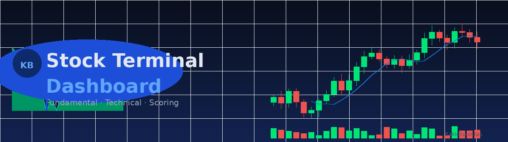

# 📊 Stock Terminal Dashboard

A personal stock research dashboard combining **fundamental analysis**, **technical indicators**, and a **custom scoring model** — built with Python + Yahoo Finance and served as a static GitHub Pages site.

**[👉 Open Live Dashboard](https://Bakidiskostas.github.io/stock-dashboard/stock_dashboard.html)**

---

## ✨ Features

- **Live price header** — current price, change %, 52-week range
- **Price chart** — switchable 1W (hourly) / 1M / 6M / 1Y views
- **Forward P/E history** — historical trend of forward valuation
- **EPS Trend table** — analyst estimate EPS over 7 / 30 / 60 / 90 days across current & next quarter/year
- **Earnings history** — actual vs estimate with surprise %
- **Fundamentals table** — 25+ metrics color-coded green / yellow / red
- **Scoring model** — 6 category scores + total, computed locally from Yahoo Finance data:
  - 📊 Valuation (P/E, Fwd P/E, PEG, P/S, P/B)
  - 🏦 Financial (Current Ratio, Debt/Equity)
  - 📈 Growth (EPS this Y, next Y, YoY TTM, Sales YoY)
  - 💰 Return (ROE, ROA, ROIC)
  - 📉 Margin (Gross, Operating, Profit)
  - 📡 Trend (SMA 200%, Short Ratio)

---

## 🗂️ How It Works

```
fetch_dashboard_data.py  →  dashboard_data.json  →  stock_dashboard.html
       (Python)                  (static file)          (GitHub Pages)
```

1. Python script pulls all data from **Yahoo Finance** (no third-party scraping)
2. Saves everything to `dashboard_data.json`
3. HTML dashboard reads the JSON and renders — no backend needed
4. GitHub Actions runs the fetch script **daily at 06:00 UTC** and auto-commits

---

## 🚀 Setup

### Prerequisites
```bash
pip install yfinance pandas numpy
```

### Run locally
```bash
python fetch_dashboard_data.py
python -m http.server 8080
# open http://127.0.0.1:8080/stock_dashboard.html
```

### Or use the batch file (Windows)
```
start.bat
```

---

## ⚙️ GitHub Actions — Auto Update

The workflow `.github/workflows/update_data.yml` runs daily and:
1. Fetches fresh data for all tickers
2. Commits `dashboard_data.json` back to the repo
3. GitHub Pages serves the updated file automatically

To trigger manually: **Actions → Update Dashboard Data → Run workflow**

---

## 📦 Tickers Covered

59 tickers across semiconductors, AI infrastructure, cloud, energy, and tech:

`AAPL · ALAB · AMAT · AMD · AMZN · ANET · APP · ARGX · ASML · AVGO · BE · CALX · CCJ · CEG · CLS · COHR · CRDO · CSCO · ETN · FIX · GEV · GOOGL · KLIC · LLY · LRCX · IBM · IESC · INOD · INTC · IONQ · MRVL · META · MP · MSFT · MU · MTSI · NBIS · NET · NFLX · NOW · NVDA · ONTO · PLTR · ROKU · RSI · S · SITM · SNOW · SPCX · SYM · TER · TSM · TSEM · TTMI · V · VRT · VST · WDC · ZETA`

---

## ⚠️ Disclaimer

Personal research tool — not financial advice.

---

<p align="right"><sub>Built by <strong>KB</strong> · Data: Yahoo Finance</sub></p>
